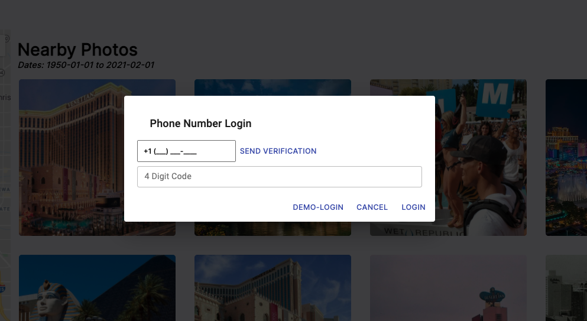

<!--
*** Thanks for checking out the Best-README-Template. If you have a suggestion
*** that would make this better, please fork the repo and create a pull request
*** or simply open an issue with the tag "enhancement".
*** Thanks again! Now go create something AMAZING! :D
***
***
***
*** To avoid retyping too much info. Do a search and replace for the following:
*** JHorst2020, PhoLo, twitter_handle, jerzyhorst@gmail.com, project_title, project_description
-->


<!-- PROJECT SHIELDS -->
<!--
*** I'm using markdown "reference style" links for readability.
*** Reference links are enclosed in brackets [ ] instead of parentheses ( ).
*** See the bottom of this document for the declaration of the reference variables
*** for contributors-url, forks-url, etc. This is an optional, concise syntax you may use.
*** https://www.markdownguide.org/basic-syntax/#reference-style-links
-->
[![Contributors][contributors-shield]][contributors-url]
[![Forks][forks-shield]][forks-url]
[![Stargazers][stars-shield]][stars-url]
[![Issues][issues-shield]][issues-url]
[![MIT License][license-shield]][license-url]
[![LinkedIn][linkedin-shield]][linkedin-url]


<!-- PROJECT LOGO -->
<br />
<p align="center">
  <a href="https://github.com/JHorst2020/PhoLo">
    
  </a>

  <h3 align="center">PhoLo</h3>

  <p align="center">
    A geosocial app that allows users to filter photos by date and location. 
    <br />
    <a href="https://github.com/JHorst2020/PhoLo"><strong>Explore the docs »</strong></a>
    <br />
    <br />
    <a href="https://github.com/JHorst2020/PhoLo">View Demo</a>
    ·
    <a href="https://github.com/JHorst2020/PhoLo/issues">Report Bug</a>
    ·
    <a href="https://github.com/JHorst2020/PhoLo/issues">Request Feature</a>
  </p>
</p>


<!-- TABLE OF CONTENTS -->
<details open="open">
  <summary><h2 style="display: inline-block">Table of Contents</h2></summary>
  <ol>
    <li>
      <a href="#about-the-project">About The Project</a>
      <ul>
        <li><a href="#built-with">Built With</a></li>
      </ul>
    </li>
    <li>
      <a href="#getting-started">Getting Started</a>
      <ul>
        <li><a href="#prerequisites">Prerequisites</a></li>
        <li><a href="#installation">Installation</a></li>
      </ul>
    </li>
    <li><a href="#usage">Usage</a></li>
    <li><a href="#roadmap">Roadmap</a></li>
    <li><a href="#contributing">Contributing</a></li>
    <li><a href="#license">License</a></li>
    <li><a href="#contact">Contact</a></li>
    <li><a href="#acknowledgements">Acknowledgements</a></li>
  </ol>
</details>


<!-- ABOUT THE PROJECT -->
## About The Project




Most social media sites make it easy to find photos of a person, but not of a particular location and time. This site allows you to quickly find photos taken in 1954 at Disneyland, or view the Las Vegas Strip back in the 60's. 

Most newer cameras include EXIF data which contain the date and location that a photo was taken. When a user uploads a photo, this information is collected automatically and stored with the photo. In the event that no such EXIF data exists, a user can provide the missing details. Other users can then search for these images by simply entering a date range, and the name of a location. 


### Notable Technologies
A. Backend

* [Node.js](https://nodejs.org/en/)
* [Express](https://expressjs.com/)
* [PostgreSQL](https://www.postgresql.org/)
* [Sequelize](https://sequelize.org/)
* [Amazon AWS S3 Bucket Hosting SDK](https://aws.amazon.com/s3/)
* [GoogleMap API](https://developers.google.com/maps/documentation)
* [JSON](https://www.json.org/json-en.html)
<!--ReactSkipperEnd -->
  
B. Frontend

* [React](http://reactjs.org/)
* [Redux](https://redux.js.org/)


<!--ReactSkipperEnd -->


<!-- GETTING STARTED -->
## Getting Started

To get a local copy up and running follow these simple steps.

### Prerequisites

This is an example of how to list things you need to use the software and how to install them.
* npm
  ```sh
  npm install npm@latest -g
  ```

### Installation

1. Clone the repo
   ```sh
   git clone https://github.com/JHorst2020/PhoLo.git
   ```
2. Install NPM packages
   ```sh
   npm install
   ```


<!-- USAGE EXAMPLES -->
<!-- ## Usage -->

<!-- Use this space to show useful examples of how a project can be used. Additional screenshots, code examples and demos work well in this space. You may also link to more resources. -->


<!-- ROADMAP -->
## Roadmap

See the [open issues](https://github.com/JHorst2020/PhoLo/issues) for a list of proposed features (and known issues).


<!-- CONTRIBUTING -->
## Contributing

Contributions are what make the open source community such an amazing place to be learn, inspire, and create. Any contributions you make are **greatly appreciated**.

1. Fork the Project
2. Create your Feature Branch (`git checkout -b feature/AmazingFeature`)
3. Commit your Changes (`git commit -m 'Add some AmazingFeature'`)
4. Push to the Branch (`git push origin feature/AmazingFeature`)
5. Open a Pull Request


<!-- LICENSE -->
## License

Distributed under the MIT License. See `LICENSE` for more information.


<!-- CONTACT -->
## Contact

Jerzy Horst - Portfolio Website: https://jerzy.tech

Project Link: [https://github.com/JHorst2020/PhoLo](https://github.com/JHorst2020/PhoLo)


<!-- ACKNOWLEDGEMENTS -->
## Acknowledgements

* [App Academy](https://www.appacademy.io/)
* [Best-README-Template](https://github.com/othneildrew/Best-README-Template)


<!-- MARKDOWN LINKS & IMAGES -->
<!-- https://www.markdownguide.org/basic-syntax/#reference-style-links -->
[contributors-shield]: https://img.shields.io/github/contributors/JHorst2020/PhoLo.svg?style=for-the-badge
[contributors-url]: https://github.com/JHorst2020/PhoLo/graphs/contributors
[forks-shield]: https://img.shields.io/github/forks/JHorst2020/PhoLo.svg?style=for-the-badge
[forks-url]: https://github.com/JHorst2020/PhoLo/network/members
[stars-shield]: https://img.shields.io/github/stars/JHorst2020/PhoLo.svg?style=for-the-badge
[stars-url]: https://github.com/JHorst2020/PhoLo/stargazers
[issues-shield]: https://img.shields.io/github/issues/JHorst2020/PhoLo.svg?style=for-the-badge
[issues-url]: https://github.com/JHorst2020/PhoLo/issues
[license-shield]: https://img.shields.io/github/license/JHorst2020/PhoLo.svg?style=for-the-badge
[license-url]: https://github.com/JHorst2020/PhoLo/blob/master/LICENSE.txt
[linkedin-shield]: https://img.shields.io/badge/-LinkedIn-black.svg?style=for-the-badge&logo=linkedin&colorB=555
[linkedin-url]: https://www.linkedin.com/in/jerzy-horst-027396181/